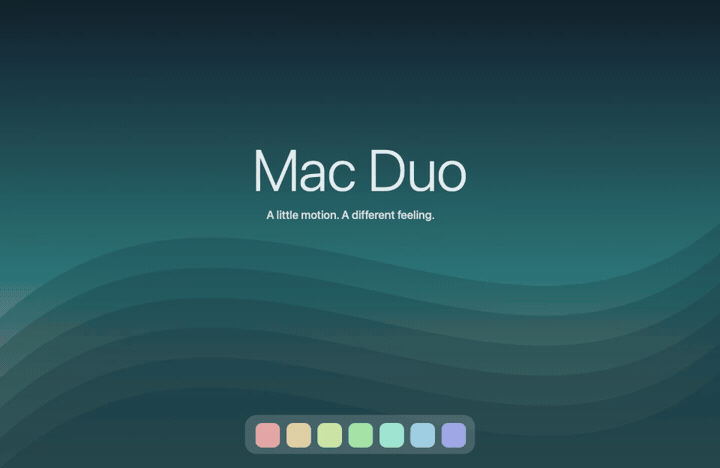
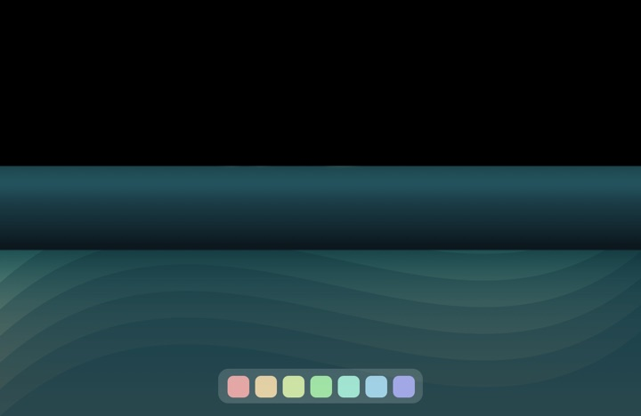
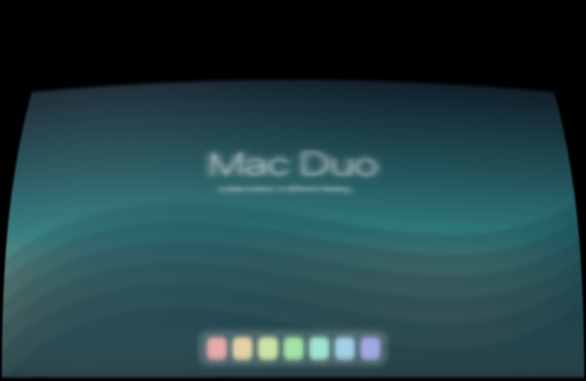
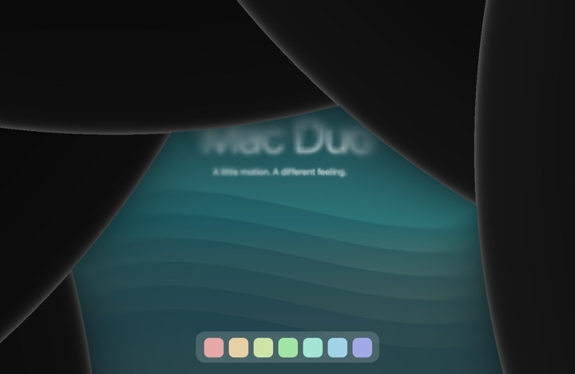

# Mac Duo

**Make your desktop feel physical.** Five effects that follow the movement of your MacBook lid.

### [↓ Download Mac Duo](https://github.com/DhananjayBhosale/MacDuo/releases/latest/download/Mac-Duo.dmg)

[Website](https://macduo.dhananjaytech.app/) · [All releases & ZIP](https://github.com/DhananjayBhosale/MacDuo/releases) · [Build from source](docs/DEVELOPMENT.md) · [Report an issue](https://github.com/DhananjayBhosale/MacDuo/issues)

 Generated Duo demo. Your real desktop stays on your Mac.

## Five ways to close

| Effect | What it feels like |
|---|---|
| **Duo** · default | The desktop expands, softens and disappears around the hinge. |
| **Roll** | A flexible display curling into a roll. |
| **Shutter** | Four rigid panels sliding behind one another. |
| **Flex** | A continuous display bowing under tension. |
| **Iris** | Precision blades closing around the desktop. |

Hold the lid still and the screen clears after **1–5 seconds**—**2 seconds** by default. Live preview, compact floating controls, orange Light/Dark themes, and menu-bar access are included. Close settings or switch desktops: Mac Duo keeps following in the background, without raising its window. Press **Esc** or **⌃⌥⌘F** to pause.

## Install

> [!NOTE]
> **MacBook compatibility · macOS 14+** 
> **Expected to work:** MacBook Air with M2 or newer, and 14-/16-inch MacBook Pro with M1 Pro/Max or newer. 
> **Unsupported:** M1 MacBook Air and 13-inch MacBook Pro with M1 or M2. 
> Tested on an M4 MacBook Pro. Mac Duo checks for a compatible lid sensor; external displays are not animated.

1. [Download **Mac-Duo.dmg**](https://github.com/DhananjayBhosale/MacDuo/releases/latest/download/Mac-Duo.dmg), open it, and drag **Mac Duo** into **Applications**.
2. Open **Mac Duo** from Applications. This release is **not notarized**, so macOS may initially block it with “cannot be opened” or “Apple could not verify” wording.
3. After trying to open it, go to **System Settings → Privacy & Security**, scroll to **Security**, click **Open Anyway** for **Mac Duo**, then confirm **Open**. [Apple’s instructions](https://support.apple.com/102445).
4. In Mac Duo, click **Enable Mac Duo** and allow **Screen Recording** when prompted. Reopen the app if macOS asks. Desktop frames stay in memory; nothing is recorded or uploaded.

Try **Replay** first—it works without Screen Recording permission. For manual control, turn off **Follow my lid**. Keep **Clear when the lid is still** enabled for normal use at any angle.

<strong>Updating or using the ZIP instead</strong>

Quit Mac Duo before replacing the app in Applications. For the ZIP, unzip it and move **Mac Duo.app** into Applications, then follow steps 2–4 above. Development signatures may require granting Screen Recording again after an update. If permission appears enabled but capture fails, remove the old Mac Duo entry in Screen Recording settings, add the current app from Applications, and reopen it.

## Small, local, open

Native **Swift + Metal**, with no third-party runtime dependencies, accounts, analytics or network access. Settled previews stop rendering; blur is cached. Rendering is capped according to power and temperature, with up to 120 Hz requested on supported displays while plugged in. Actual frame rate and battery impact vary by Mac.

[Build & verification](docs/DEVELOPMENT.md) · [Reference credits](ATTRIBUTION.md) · [MIT license](LICENSE)

Independent software, not affiliated with Apple. Contributions and hardware reports are welcome.
